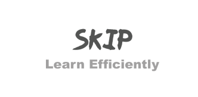

:alarm_clock: SKiP is a tools designed to increase efficiency during your study hours.
 
 ##Usage

 1.Download the Glove file from Standfords Github repository from the link given below
 <a href="http://nlp.stanford.edu/data/wordvecs/glove.6B.zip">glove.6B.zip</a>

> Unzip it and save the .txt file in the same folder as other files in the cloned repo

2.Now use the 'loading_model.py' file to convert this model into a pickle file so that it loads fast

>Loading the model as a text file takes 9 minutes on my system but may vary in yours. The lead time will not go below 5 mins so pickling it is important as it brings down the load time in my system to 8 seconds.

