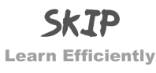
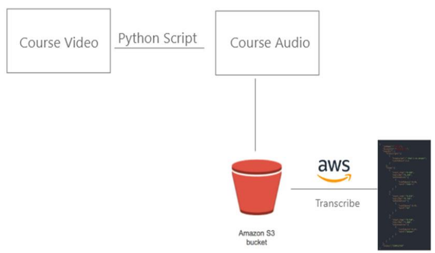

[](https://github.com/ItsSiddharth/SKiP/edit/master/LICENSE)

:arrows_counterclockwise: SKiP is a tools designed to increase efficiency during your study hours.
 
 ## Usage

 1.Download <a href="http://nlp.stanford.edu/data/wordvecs/glove.6B.zip">glove.6B.zip</a> file from Standfords Github repository from the hyperlink.
 

> Unzip it and save the .txt file in the same folder as other files in the cloned repo

2.Now use the 'loading_model.py' file to convert this model into a pickle file so that it loads fast

> Loading the model as a text file takes 9 minutes on my system but may vary in yours. The lead time will not go below 5 mins so pickling it is important as it brings down the load time in my system to 8 seconds.

3.Pass this code to an AWS bucket for it to transcribing it.

> The JSON AWS returns after transcribing will be critical in later stages. 



The <a href="https://www.youtube.com/watch?v=TlB_eWDSMt4&t=917s">Video</a> used to create the JSON in my repository is linked.

4.Rename the JSON to 'data.json'.

5.Run the 'main.py' script with the topic you want to jump to as an argument.

> Here if I wanted to go to the part where Mosh taught Modules then I give a command as below

```
$ python main.py modules
```
> Say I wanted to go to the part where he teaches path module 

```
$ python main.py path
```

* NOTE : Please enter a single word as python argument.
* NOTE : As a prerequisite have VLC media player installed.
